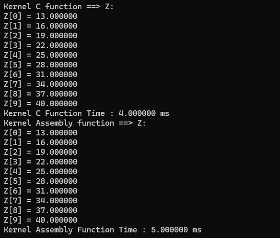
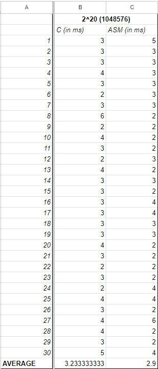
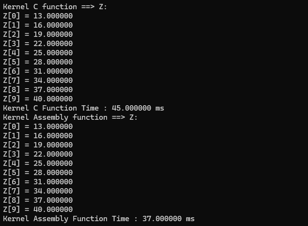
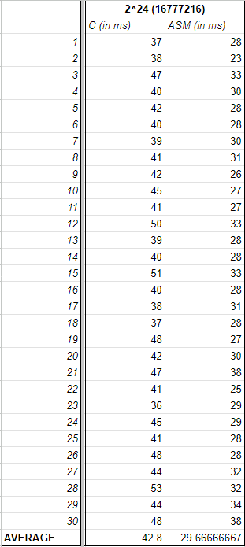
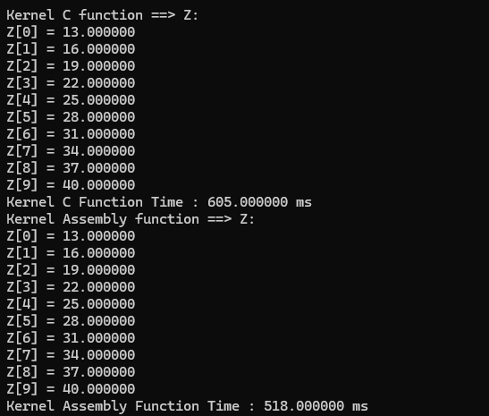
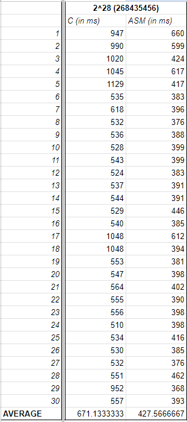

# Kernel Performance Analysis
* The DAXPY (A*X + Y) function was programmed using both the C and Assembly (x84-64) languages. A comparative analysis of the performances of both the C and assembly programs will be performed.

## Performance Analysis
* To analyze the performances effectively, the program was run 30 times on kernel sizes, 2^20, 2^24, and 2^28. Instead of using 2^30 as a kernel size, 2^28 was used due to the limitations of our machines. After this, the average of the 30 runs were taken.
### 2^20 vector size
#### Correctness Check

#### Performance

### 2^20 vector size
#### Correctness Check

#### Performance

### 2^28 vector size
#### Correctness Check

#### Performance

## Comparative Analysis
