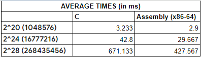

# Kernel Performance Analysis
* The DAXPY (A*X + Y) function was programmed using both the C and Assembly (x84-64) languages. A comparative analysis of the performances of both the C and assembly programs will be performed.

## Performance Analysis
* To analyze the performances effectively, the program was run 30 times on kernel sizes, 2^20, 2^24, and 2^28. Instead of using 2^30 as a kernel size, 2^28 was used due to the limitations of our machines. After this, the average of the 30 runs were taken.
### _2^20 vector size_
#### Correctness Check

#### Performance

### _2^24 vector size_
#### Correctness Check

#### Performance

### _2^28 vector size_
#### Correctness Check

#### Performance

## Comparative Analysis

By examining the averages of the execution times of the kernel, it seems that generally assembly is quicker than C in performing the kernel program. Furthermore, we can see that as the vector size increases, the performance gap between the two languages also increases. This is evidently seen in the largest vector size, 2^28 where the average for assembly is significantly lower than the average for C. Several factors contribute to the faster performance of assembly, such as how the assembly language is closer to the hardware which reduces any complications during the runtime (Brandao & Siva, n.d.). Through this, CPU usage can be optimized and processor-specific features like SIMD  instructions can be more utilized. By directly manipulating the available registers, memory, and instructions of the processor, assembly adds more precision than C and more precision leads to better efficiency. (Smith, n.d) 

In conclusion, although coding in C can provide more convenience and a less error prone experience, assembly is superior in terms of optimizing performance especially when processing large datasets. 

[Video Link](https://www.canva.com/design/DAGX98KcIX4/hIr1zLKzp09n9SVFOJQ3Zw/edit?utm_content=DAGX98KcIX4&utm_campaign=designshare&utm_medium=link2&utm_source=sharebutton)

[Test Cases Sheet](https://docs.google.com/spreadsheets/d/1edHS8W2h-kov1z-2XiyYBnptQEsEYxSvrnSPEkDHJtU/edit?gid=1606487804#gid=1606487804)

Sources:

Brandao, H. and Siva B (n.d.). What are the trade-offs between using C and Assembly?. Retrieved from:  https://www.linkedin.com/advice/3/what-trade-offs-between-using-c-assembly-skills-computer-science-ljvrf#:~:text=Assembly%20code%20can%20be%20more,operating%20systems%2C%20or%20device%20drivers.

Smith S. (n.d.) The Scientists and Engineer’s Guide to Digital Signal Processing. Chapter 28: C versus Assembly. Retrieved from:   https://www.dspguide.com/ch28/5.htm

