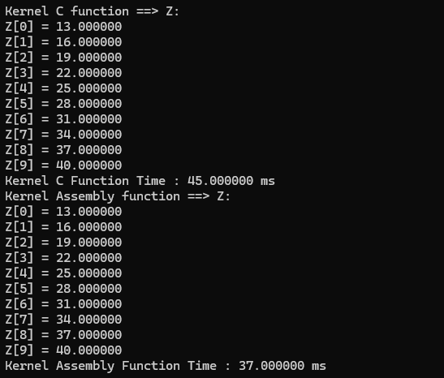

# Kernel Performance Analysis
* The DAXPY (A*X + Y) function was programmed using both the C and Assembly (x84-64) languages. A comparative analysis of the performances of both the C and assembly programs will be performed.

## Performance Analysis
* To analyze the performances effectively, the program was run 30 times on kernel sizes, 2^20, 2^24, and 2^28. Instead of using 2^30 as a kernel size, 2^28 was used due to the limitations of our machines. After this, the average of the 30 runs were taken.
### 2^20 vector size
#### Correctness Check

#### Performance

### 2^20 vector size
#### Correctness Check

#### Performance

### 2^28 vector size
#### Correctness Check

#### Performance

## Comparative Analysis
-- better to include table here w/ summary ng average --
By examining the averages of the execution times of the kernel, it seems that generally assembly is quicker than C in performing the kernel program. Furthermore, we can see that as the vector size increases, the performance gap between the two languages also increases. This is evidently seen in the largest vector size, 2^28 where the average for assembly is significantly lower than the average for C.
